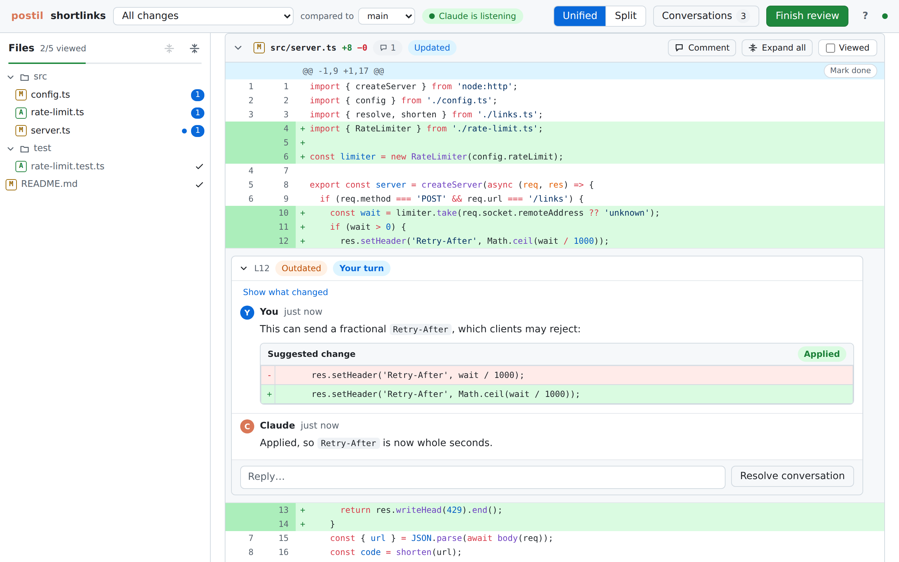
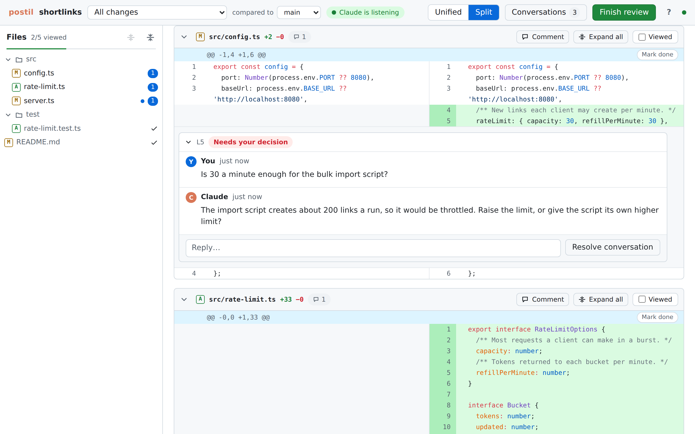

# postil

Local code review for diffs that Claude Code produces.

Review changes in a browser, leave comments on line ranges, and submit a review. A Claude Code
session picks the review up automatically, edits the code, and replies to each thread. Iterate
until you resolve every thread. Everything stays on your machine.

*A postil is a marginal note on a text.*

<picture>
  <source media="(prefers-color-scheme: dark)" srcset="docs/screenshots/review-dark.png">
  
</picture>

<picture>
  <source media="(prefers-color-scheme: dark)" srcset="docs/screenshots/split-dark.png">
  
</picture>

## Setup

Requires Node 24, git 2.43 or newer, and Claude Code.

```sh
git clone https://github.com/sakian/postil.git ~/postil && cd ~/postil
npm install
npm run install-plugin          # builds postil and installs its Claude Code plugin from this checkout
```

The plugin is self-contained: it runs from a bundle inside the plugin with plain `node`, so
nothing needs to be on your PATH. For the `postil` command in your own terminal (`status`,
`open`, `doctor` and so on), link it once:

```sh
node plugin/dist/postil.mjs link   # puts postil in ~/.local/bin
```

On Windows, `link` writes two small launchers instead of a symlink: `postil.cmd` for cmd and
PowerShell, and `postil` for Git Bash. The Claude Code installer usually puts `~\.local\bin` on
your PATH already.

After pulling changes, run `npm run install-plugin` again: Claude Code only picks up a rebuilt
plugin on reinstall. `postil doctor` checks the whole setup.

## Use

In a Claude Code session in the repository you want to review, run:

```
/postil:review
```

Claude starts the review server (if it is not already running), opens the UI, and starts
listening. Review the diff, leave comments, and press **Submit review**. Claude picks the review
up on its own, changes the code, replies to each comment, and marks the review complete. Reply
again or resolve threads, submit again, and repeat until you are happy. The header shows whether
Claude is listening.

When every file is viewed and every conversation resolved, **Finish session** archives the
conversations and tells Claude to stop listening, and can have it commit anything left and push,
or do whatever you type for it instead. If a review has nothing to say, **Finish review**
offers to finish the session straight away. To have Claude commit its changes after each review instead (never pushing), tick that option
under **Finish review**.

To abandon a review part-way, say because Claude's session ended mid-review and it is blocking
a new one, press **Discard review** under **Finish review**, run `postil reset`, or run
`/postil:review reset`. Every conversation and review moves to **Archived**, unsent comments are
deleted, viewed marks are cleared, and a listening Claude drops what it was doing and waits for
your next review. `postil stop` only stops the server; your reviews survive it.

For hands-free rounds, Claude must be able to edit without asking: run the session in
accept-edits or auto mode. The plugin's hooks act only in the session that ran `/postil:review`;
another session started in the same repository is just told, in one line, that a review server
is running.

By default "all changes" means the changes on your branch since it left the branch its pull
request targets (asked of `gh`, when it is installed) or else `main`, or, on `main` itself,
everything since postil was first used in the repository. `postil base --branch <b>` measures
from where your branch left `<b>`, following it as a pull request would; `postil base <rev>`
measures from a fixed commit; `postil base --empty` puts every file in the repository under
review; and `postil base --reset` goes back to the default.
The scope menu in the UI also offers uncommitted changes, changes since your last review, and any
range of commits.

postil keeps its state (reviews, comments, the server's address and token) in `.git/postil/`
and pins the snapshots it needs under `refs/postil/`. It adds nothing to your working tree, and
the server only listens on `127.0.0.1`.

Other commands: `postil start`, `stop`, `status`, `open`, `url`, `base`, `archive`, `reset`, `doctor`, and
`help`.

## Features

- Unified and split diffs, with context you can expand and collapse again, syntax highlighting,
  changed words highlighted within lines, and image previews.
- Comments on any line range, sent as a review. Claude replies in each thread and may flag one
  as needing your decision; only you resolve threads.
- Suggestions in comments apply with one click, or Claude can apply them.
- Review all changes, uncommitted changes, changes since your last review, or any range of
  commits. Files updated since your last review are marked.
- Comments follow their code as it moves. Comments on code that changed are marked outdated and
  show what changed.
- Mark files viewed or individual sections done. Marks stay through edits elsewhere in the file.
- Keyboard shortcuts (press `?`), smooth scrolling through reviews of 2,000 files, and archiving
  of finished conversations.
- Claude can commit its changes after each review, or commit and push when you finish the
  session.
- Works in several repositories and worktrees at once, and is safe against Claude editing while
  you review.

## Limitations

- The automatic wake-up relies on Claude Code's `Monitor` tool listening on a WebSocket, which is
  not documented and could change. If it stops working, the plugin's hooks still hand Claude the
  review the next time it is active.
- postil is installed from a checkout. It is not yet published to npm or a hosted plugin
  marketplace.
- Tested on Linux and Windows.
- Everything is local: reviews live in one clone and are not shared between machines.

## Development

Requires Node 24 and git 2.43 or newer. Node runs the TypeScript sources directly.

```sh
npm install
npm run build                 # build the UI into web/dist, then bundle the plugin into plugin/dist
npm run check                 # typecheck and run the unit and integration tests
node src/cli/main.ts serve    # serve the repository you are in, from source
node src/cli/main.ts open     # open the review UI in your browser
claude --plugin-dir ./plugin  # try the plugin without installing it (after npm run build)
```

UI development with hot reload, against a running server:

```sh
POSTIL_URL=http://127.0.0.1:<port> npm run dev:web
```

Then open `http://localhost:5173/#token=<token>`, with the token from `postil url`.

`npm run screenshots` regenerates the screenshots above from a demo repository (after
`npm run build`).

`node e2e/perf.ts` loads and scrolls a synthetic review (300 files; set `FILES=2000` for more)
and reports load time, main-thread blocking and DOM size.

Live tests run real Claude Code sessions with the plugin's bundle, so run `npm run build` first.
They cost money and depend on the model, so they are run by hand: `node e2e/live/headless.ts`
and `node e2e/live/interactive.ts` (the second needs tmux, so it does not run on Windows).

Browser tests drive the built UI in headless Chromium. They need Playwright's browser and its
system libraries once:

```sh
npx playwright install --with-deps chromium
npm run build && npm run test:e2e
```

See [`docs/ARCHITECTURE.md`](docs/ARCHITECTURE.md) for how postil works.

## License

[MIT](LICENSE)
